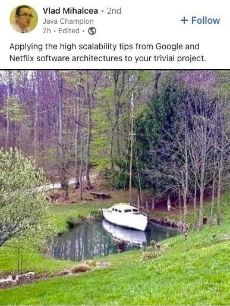

Under construction

# Home of my webpage

> Visit [niklaslindroos.fi](http://niklaslindroos.fi) to see this in action

This repository hosts the source code for
[niklaslindroos.fi](http://niklaslindroos.fi).

## Tech details

This app is built with [Remix](https://remix.run/) with
[the Epic Stack](https://www.epicweb.dev/epic-stack). It is mostly overkill for
it's simple nature. The main reasoning behind the tool choices is the ability to
choose the latest & greatest.

The meme below is an apt description of the setup of this app.

## Licensing

This project is licensed under the [MIT license](LICENSE).

